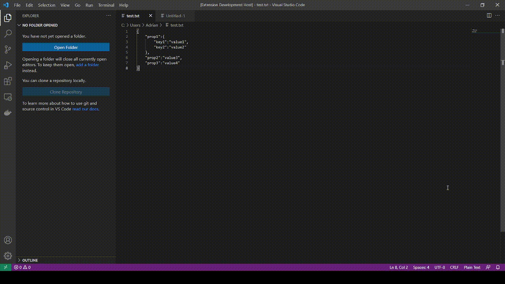

# Structure-Replacer Extension

## Features

Supported structures (two way converting):
* JSON
* Minified JSON
* Y(A)ML
* PHP Array
* Minified PHP Array
* XML (Beta)

### Commands Pallete

* Replace selectes structure after detection and selection target structure form Quick Pick list
* Generate new document with target structure in Quick Pick List to selected string.

## Extension Settings

* `vestibule-bs.validateUncoveredStructures`: Valid uncovered structures without strict filtering types with meta language and file metadata.

## How to use

**Enjoy!**